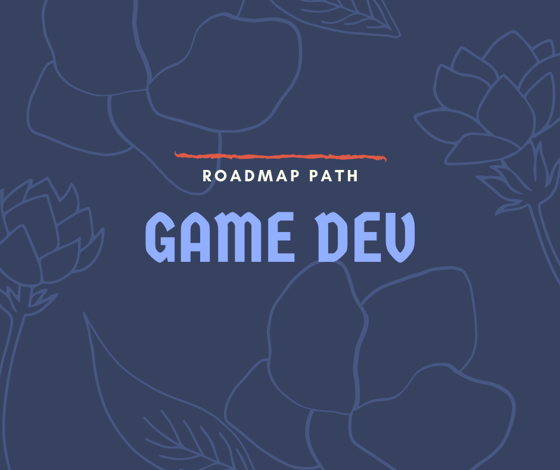

# Game developer preparer

- [ ] Learn to Research
- [ ] Communication Skills
- [ ] Question / Answer and Search

# Client Programmer

## Basics

- [ ] Learn Data Structure an Data Structure

## Programming Languages
- [ ] Assembly
- [ ] C
- [ ] C++
- [ ] C#
- [ ] Lua
- [ ] Python
- [ ] HTML5
### Game mathematics

- [ ] Linear Algebra
- [ ] Calculus
- [ ] Discrete Mathematics
- [ ] Engineering  Mathematics
- [ ] Numberical Analysis
- [ ] Probability and Statistics

### Game Physics

- [ ] Classical Mechanics
- [ ] Optics
- [ ] Fluid Mechanics

### Game Engines

- [ ] Unity
- [ ] Unreal
- [ ] Godot
- [ ] Cocos2d-x
### Grahphics API

- [ ] DirectX
  - [ ] HLSL
- [ ] OpenGL
  - [ ] GLSL
- [ ] Vulkan
  - [ ] SPIR-V
- [ ] WebGL
- [ ] Metal

### Graphics theory

- [ ] Rendering Pipeline
- [ ] Polygonal Techniques
- [ ] Curves and Curved Surfaces
- [ ] Acceleration Algorithms
- [ ] Pipeline Optimizations
- [ ] Intersection Test Methods
- [ ] Collision Detection
- [ ] Tranforms
- [ ] Shading
- [ ] Visual Appearance
- [ ] Texturing
- [ ] Area and Environmental Lighting
- [ ] Global Illumination
- [ ] Image-Base Effects
- [ ] Non-Photorealistic Rendering

### Computer Theory

- [ ] Computer Architecture
- [ ] Computer System
- [ ] System Programming
- [ ] Computer Graphics
- [ ] Artificial Intelligence
- [ ] Database Management

#### OS

- [ ] Windows
- [ ] Linux
- [ ] Mac

### Game AI

- [ ] Movement
- [ ] Pathfinding
- [ ] Decision Making
- [ ] Tactical and Straegic AL
- [ ] Learning
- [ ] Board Games
- [ ] Execution Management 
- [ ] Event Management
- [ ] Content Creation

