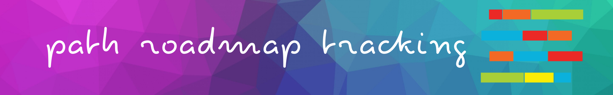
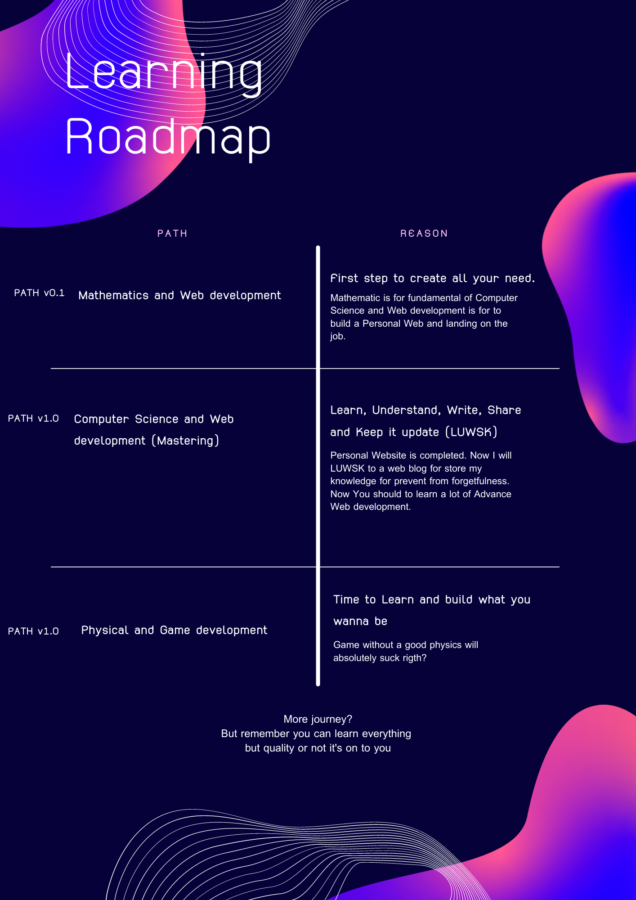
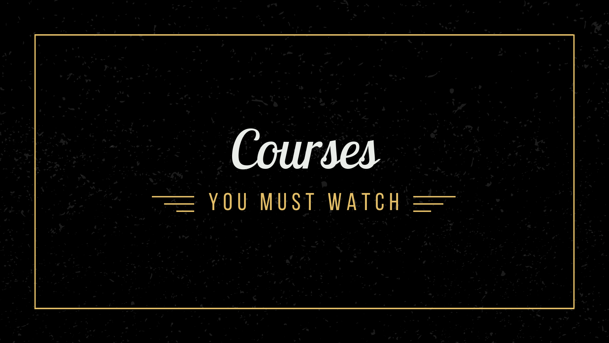
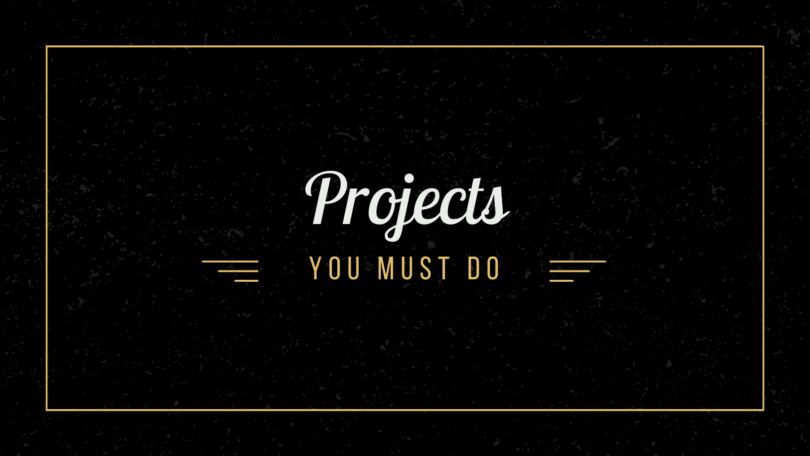

Tracking Path and I'm wrote blog in [this repository](https://github.com/LUXIAZx/Blog-Data)

At present: __PATH v0.1__

# Roadmap
## Mathematic

> Without mathematics, there’s nothing you can do. Everything around you is mathematics. Everything around you is numbers.
> — Shakuntala Devi, Indian writer and mental calculator

## Computer Science

> "Computer Science is a science of abstraction -creating the right model for a problem and devising the appropriate mechanizable techniques to solve it."
> ― Alfred Aho

## Web development

> “A successful website does three things: It attracts the right kinds of visitors. Guides them to the main services or product you offer. Collect Contact details for future ongoing relation.”
> ― Mohamed Saad

### Book :book:

### Course 📺

### Project 💻

