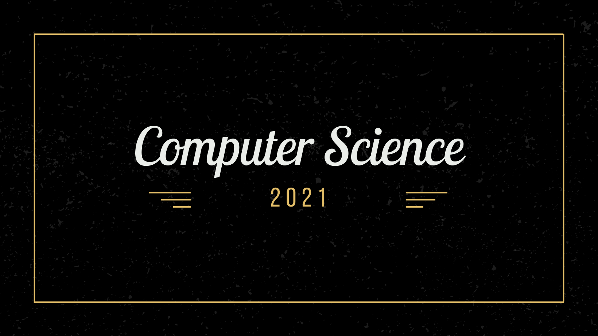

> Awesome Roadmaps  in 2021

> "Computer Science is a science of abstraction -creating the right model for a problem and devising the appropriate mechanizable techniques to solve it."
> \- Alfred Aho

> “Websites should look good from the inside and out.”
> \- Paul Cookson

> “Gamers can feel when developers are passionate about their games. They can smell it like a dog smells fear. Don't be afraid to hold onto your unique vision: just be aware that it may not turn out exactly how you envisioned.”
> \- Scott Rogers. (Level Up! : The Guide to Great Video game design)

> "Data is what you need to do "Analytics" information is what you need to do "Business"
> \- John Owen

> "One single vulnerability is all an attacker needs."
> \- Window Synder; Chief Security Officer, Fastly 

 

